# PointCloudCore-DDD  

轻量级跨语言领域驱动框架 .NET Core版  

---  

[PointCloudCore-DDD](#pointcloudcore-ddd)  

- [1. 简介](#11-简介)  
- [2. 开始使用](#2-开始使用)  
- [2.1. NetSocket](#21-netsocket)  
  - [2.2. AMQP](#22-amqp)  
  - [2.3. Repository](#23-repository)  
  - [2.4. RPC](#24-rpc)  
  - [2.5. DomainCore](#25-domaincore)  
  - [2.6. A+ES](#26-aes)  
- [3. 设计思路](#3-设计思路)  
  - [3.1. NetSocket 设计方案](#31-netsocket-设计方案)  
    - [3.1.1. NetSocket 设计思想](#311-netsocket-设计思想)  
    - [3.1.2. NetSocket 代码解析](#312-netsocket-代码解析)  
  - [3.2. RPC 设计方案](#32-rpc-设计方案)  
    - [3.2.1. RPC 设计思想](#321-rpc-设计思想)  
    - [3.2.2. RPC 代码解析](#322-rpc-代码解析)  
  - [3.3. Repository 设计方案](#33-repository-设计方案)  
    - [3.3.1. Repository 设计思想](#331-repository-设计思想)  
    - [3.3.2. Repository 代码解析](#332-repository-代码解析)  
  - [3.4. Core 设计方案](#34-core-设计方案)  
    - [3.4.1. Core 设计思想](#341-core-设计思想)  
    - [3.4.2. Core 代码解析](#342-core-代码解析)  
  - [3.5. A+ES 设计方案](#35-aes-设计方案)  
    - [3.5.1. A+ES 设计思路](#351-aes-设计思路)  
- [4. 结束语](#4-结束语)  

---  

## 1. 简介  

本项目为一套学生用轻量级跨语言领域驱动框架，旨在帮助学生在学习企业级框架的路上指引方向和放缓学习曲线。 因此在编写框架的时候会刻意的仿照当前语言环境下各个工具的使用方式，意在学生在完全掌握企业级工具的使用之前先适应其使用方式并思考其实现的基本原理思想，同时本框架也可以和现有的企业级框架共同使用，二者之间不存在冲突，当充分学习了企业级框架的使用方法后，可以毫无负担的抛弃框架或者通过简单重构的方式来进行过度。  

整体框架主要包含 6 大模块：IOC、Repository、NetSocket、RPC、AMQP、A+ES 。文档本身也围绕着这 6 大模块来进行说明，各个模块之间相辅相成，共同满足一个简单应用程序最为基础的需求。  

---  

## 2. 开始使用  

基础运行环境为：.NET Core 3.1  

拓展环境： RabbitMQ.Client 、 Newtonsoft.Json 与 EntityFramework Core 可在NuGet上安装对应版本的包。  

代码完全开源，可以直接将PointCloudCore文件夹放置项目中，通过```using PointCloudCore```来使用对应的模块。  

因为是一套应用程序快速开发框架，所以需要按照软件工程学的方式构件整个应用软件结构，因此您需要掌握一定的软件工程学的知识，框架辅助软件结构快速搭建并提供基础功能支持。框架整体结构如下所示：

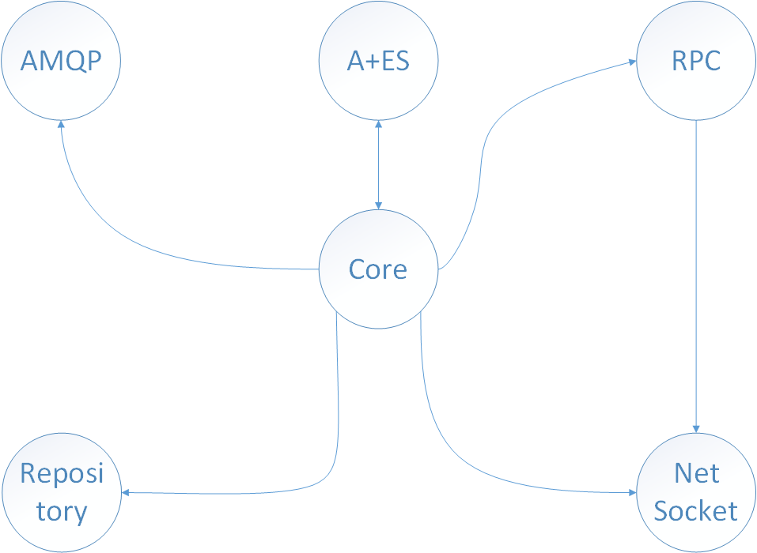  

本框架是基于DDD（*Domain-Driven-Design*）**[Eric Evans]** 思想编写的，在结合领域驱动设计思想构件应用程序会更加的快捷，可专注于领域的实现，因此在应用程序架构搭建上建议采用以下结构搭建领域驱动：

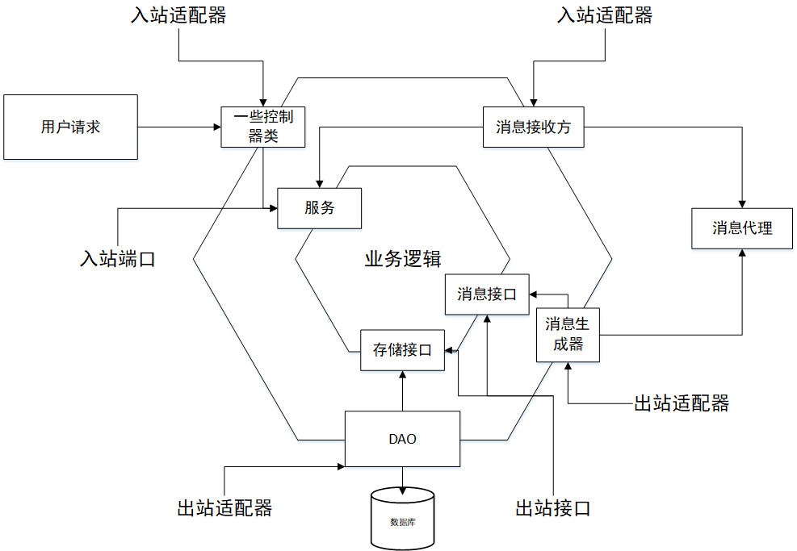  

想要使用框架进行快速开发，就需要知道框架的体系结构以及框架中各个模块之间的关系，正如图下所示，虽然部分模块可以单独使用，但是为了更好的使用体验，建议全部使用。  

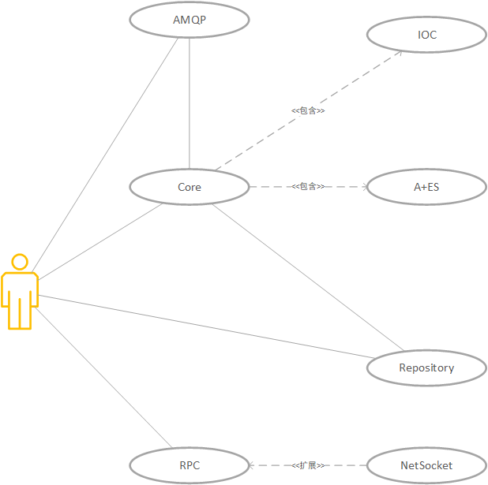  

---  

### 2.1. NetSocket  

NetSocket 模块用于**建立 Socket 通讯**，并提供相应的Socket功能，是对 .NET Core 本身的 Socket 机制进行封装与简便性改造。  

首先我们要使用 NetSocket模块，模块位于 Net 包下  

```c#
using PointCloudCore.Net.NetSocket;
```  

要想使用 Socket 功能，就要先初始化模块对象：  

```c#
NetSocketCore server = new NetSocketCore("127.0.0.1", 9000);
```  

NetSocket 模块有着两种不同的状态：服务端和客户端，两者通过连接方式来区分，绑定并监听的是服务端，连接的是客户端。  

```c#
//服务端绑定并监听端口
server.LinkBind();

//客户端连接服务端
Socket socket = client.Connect();
```  

当我们使用客户端连接服务端的时候， Connect 方法执行成功会返回 Socket 对象，连接成功之后就可以通过 Socket 往服务端发送信息。  

```c#
Socket socket = client.Connect();
//往服务端发送消息
Test test = new Test("Hello mytest!");
client.Send(test.SystemSerializer);
```  

> 注意：如果是客户端的话，后续获得 Socket 的方法只有通过 NetSocketCore 对象的迭代器来进行访问,其中 “0.0.0.0” 指代是本身的 Socket ，迭代器中访问的参数是 Socket 中的 RemoteEndPoint ：  
>
>```c#
>Socket socket = client["0.0.0.0"]
>```  
>
> 当然，直接使用 NetSocketCore 对象操作的也就是本身的 Socket 。与客户端的Socket指代的是本身的Socket连接，同样的服务器端本身 Socket 和原有功能是一致的，也就是负责监听端口。  

通过这样简单的方式客户端就成功使用 Socket 往服务端发送了一条信息。然而服务端要怎么处理多个客户端发送的信息呢？有三种不同的方式来实现：  

1. 通过迭代器访问的形式：```c# server["RemoteEndPoint"]```  

2. 通过重载 AcceptInfo() 方法，改变默认的 Accept 方法， 可以将 AcceptSocket 提出出来单独处理。  

3. 通过 NetSocket 提供的 Socket 列表： SocketsMap ，列表为字典，可以通过遍历的方式来获取字典中的 Socket ```c# foreach (var pair in server.SocketsMap)```  

```c#
foreach (var pair in server.SocketsMap)
{
byte[] bb = new byte[NetSocketCore.ByteSize];
pair.Value.Receive(bb);//接收二进制流
Test test = bb.SystemDeserializer<Test>();//将二进制流反序列
Console.WriteLine(test.Text);
}
```  

NetSocket 模块自带了两种不同的 Send 方法，提供两种不同的需要：  

· ```c# client.Send(test.SystemSerializer);``` 通过自身的 Socket 发送数据。  

· ```c# client.Send(test.SystemSerializer,socket2);``` 通过指定的其他 Socket 发送数据。  

> NetSocket 模块提供的 Send() 方法并不提供序列化方式，但是如果使用了 NetSocket 模块，模块本身提供拓展方法，为对象和字符串提供了序列化和反序列的方法，为 byte[] 提供反序列化方法：  
>
>```c#
>object.SystemSerializer//使用系统序列化方法
>objcet.ToJson//将对象转成 JSON 字符串
>objcet.ToJsonByte//将对象序列化成 JSON 二进制流
>JsonString.Json2Object<TObject>//将JSON
>String.stringSerializer(Encoding)//将字符串序列化成二进制流
>byte.stringDeserializer(Encoding)//将二进制流反序列化成字符串
>byte.Json2ObjectDeserialize<TObject>//将二进制流反序列化成对象
>bb.SystemDeserializer<TObject>//将二进制流通过系统反序列方法转化成对象
>```  
>
> 模块对字符串序列化方法默认采用的是 Encoding.UTF8 ，如果需要别的编码请使用字符串序列化与反序列化方法。  

---  

### 2.2. AMQP  

AMQP 模块目前只支持 RabbitMQ ，是对 RabbitMQ.Client 的封装。要使用此模块，需要先安装 RabbitMQ 所需要的运行环境与编程环境：  

NuGet： RabbitMQ.Client  

此模块只是一套模板，通过对模板的再实现完成对 RabbitMQ 的使用。要想使用此模块，需要```c# using PointCloudCore.Net.AMQP.RabbitMQ;```样例如下所示：  

```c#
public class RabbitMQDemo : NetRabbitMQ
{
    public RabbitMQDemo() : base("admin","password","localhost"){}

    public override void Send(string exchange,string queueName,string routingKey,byte[] data)
    {
        var channel=this[queueName];
        var properties = channel.CreateBasicProperties();
        properties.DeliveryMode = 1;
        channel.BasicPublish(exchange, routingKey,true, properties,data);
    }
}
```  

由于本模块只是对 RabbitMQ.Client 的封装，因此更多的使用方法需要查看 [RabbitMQ文档](https://www.rabbitmq.com/tutorials/tutorial-one-dotnet.html),如上样例所示，就能够轻易的使用 RabbitMQ 。  

```c#
RabbitMQDemo rabbit = new RabbitMQDemo();
//绑定交换规则、队列名、路由码
rabbit.Bind(".NETTest", ".NETTest", "1");
//发送数据
rabbit.Send(".NETTest", ".NETTest", "1", Encoding.UTF8.GetBytes("RabbitMQ!"));
```

正如 RabbitMQ 官方文档所述，接收方式如下：  

```c#
//从迭代器中获取通道模型
IModel channel = rabbit[".NETTest"];
//创建接收事件
var consumer = new EventingBasicConsumer(channel);
string message = null;
//接收事件注册
consumer.Received += (ch, ea) =>
{
    var body = ea.Body;
    message = Encoding.UTF8.GetString(body);
    Console.WriteLine(message);
};
channel.BasicConsume(".NETTest", true, consumer);
```

关于 RabbitMQ 的消息接收方式，在后续的 Core 核心模块中有对应的增强方法集成，可以快速方便的接受 RabbitMQ 的消息。  

---  

### 2.3. Repository  

Repository 模块为一套存储库模板，通过对 Repository 的实现和对接口 IRepository 的实现来完成存储库的设计。  

Repository 与 IRepository 位于 Repository 包中，因此需要```c# using PointCloudCore.Repository;```

只需要实现缺少的部分就能够使用存储库的功能，Repository 模块自带一个简易基于 LRU 算法的 Entity Cache。在此中使用 ORM 工具完成与数据库之间的连接交互

```c#
public class RepositoryDemo : Repository<IdentityKey, EntityDemo>,
                              IRepository<EntityDemoIdentity, EntityDemo>
```  

当完成了 Repository 的构件后，就可以轻易的使用存储库功能：  

```c#
//初始化存储库
RepositoryDemo repository = new RepositoryDemo();
//2.从存储库中获取实体
EntityDemo demo = repository.GetEntity(new EntityDemoIdentity(100));
```  

对于数据库的 CRUD 等操作就可通过对 Repository 实现中完成。框架样例中提供了 [Repository 实现的样例](PointCloud%20Core/demo/RepositoryDemo.cs)  

---  

### 2.4. RPC  

RPC 模块通过 NetSocket 模块提供的通讯机制完成远程过程调用的服务。RPC 模块同样分为客户端和服务端，除了框架自带的客户端与服务端实现，也可以通过继承核心类与接口的方式自定义 RPC 客户端与服务端的实现。  

想要自定义实现客户端和服务端的 RPC 对象，可以参考样例：  

· [RPCInvoke](PointCloud%20Core/PointCloudCore/Net/RPC/RPCInvoke.cs)  
· [RPCProxy](PointCloud%20Core/PointCloudCore/Net/RPC/RPCProxy.cs)

框架自带的RPC实现已经提供了 RPC 的基本功能：注册、描述和执行，并且极大程度上降低了使用的难度：  

想要使用RPC模块则需要```c# using PointCloudCore.Net.RPC;```

对于服务端而言，最重要的莫过于对于被调用函数的描述和注册，在定义参数描述的时候遵循规则：传入参数--返回参数 的顺序进行函数描述。

```c#
 //初始化RPC服务端并监听
RPCInvoke invoke = new RPCInvoke("127.0.0.1", 8888);
//注册调用函数
invoke.Register<Param, string>("Add", Add);
```  

客户端只需要连接上服务端，并根据服务端已注册的函数的描述来进行调用：  

```c#
//初始化RPC客户端并监听
IRPCProxy proxy = new RPCProxy("127.0.0.1", 8888);
//调用函数并获得结果
string result = proxy.DoFunc<Param, string>("Add", new Param("Demo:", "Test1"));
```  

>要使用 RPC 功能需要有一个前提：客户端在调用远程函数的时候，必须正确描述被调用函数的信息，包括不仅限于名称与传入参数信息，RPC 模块支持跨语言调用函数，因此更加需要客户端将信息描述完整且准确。  
>如果信息描述不完整，或者信息描述不正确，都无法成功调用。  

---  

### 2.5. DomainCore  

DomainCore 模块正如其名，作为领域的核心模块，主要提供了以下功能：  

· IOC与DI  
· Aggregate + EventSourcing 模式
· Entity 模式  
· ErrorException  
· AMQP增强  

其中 ErrorException 是由 DomainCore 模块提供的特殊的异常处理方式，将运行时错误显示并保存。A+ES 模式与 Entity 模式则在后面会说道。 Core 核心提供了对于 AMQP 模块的集成和对于 IOC 模块的集成。

DomainCore 模块的所有组件都在 DomainCore 包中，因此想要使用 DomainCore 提供的服务则需要```c# using PointCloudCore.DomainCore;```  

Core 模块秉承了简洁实用的风格，使用Core的方式也是异常的简单：  

> Core 模块位于 DomainCore 中，因此需要```c# using PointCloudCore.DomainCore.Core;```

```c#
public static void Main(string[] args)
{
    Core.CoreName = "PointCloud Core";
    //初始化核心
    Core core = Core.Instance;
    //使用注册
    core.Use((IOC) =>
    {
        IOC.Register<TService, TImplementation>(objectList[] ,Life, "ScopeName", "Name");
    });
}
```  

如上所示，通过这样的方法就成功将目标类注册到 IOC 容器中，实现控制反转。同样的要实现依赖注入（DI） 也是很简单的一件事情。  

```c#
TClass object = Core.Resolve<IClass>("ScopeName","Name");
```  

IOC 模块支持的功能不仅仅是这么简单，在 Core 模块中还增加了特性，通过特性的标注，来让 IOC 模块可以对属性，对构造函数，对方法进行依赖注入。  

```c#
class objcet
{
    //属性注入
    [Property]
    Tclass tobject;

    Tclass ttobject;

    //构造函数注入/参数注入
    [Constructor]
    object([Parameter]a,[Parameter]b){}

    //函数注入/参数标注
    [MethodInjection]
    private void add([Name("Name")][Scope("ScopeName")]Tclass ttobject)
    {
        this.ttobject=ttobjcet;
    }
}
```  

> IOC 模块默认使用的是构造函数注入，想要实现 IOC 功能，就要使用配套的特性来对参数或者属性、函数进行标注，特性优先级：构造函数、属性、函数 > Name > Scope , Scope 默认为 "Default"  
> IOC 功能严格遵守 DIP 原则

Core 模块的功能不单单包含着 IOC 和 DI ，还有对于 RabbitMQ 的增强方法，从而使得使用 RabbitMQ 更加的方便！~~  

```c#
    //使用AMQP
    core.UseAMQP(() =>
    {
        abbitModule module = new RabbitModule("admin", "password", "localhost");
        module.Bind(".NETTest", ".NETTest", "1");
        return module;
    });

    //注册AMQP接受事件
    Core.Instance.AMQPReceive(".NETTest", (consumer) =>
    {
        consumer.Received += (ch, ea) =>
        {
            byte[] body = ea.Body;
            name = body.SystemDeserializer<Test>();
        };
        return consumer;
    });
 }
```  

当然 Core 模块强大的功能作用于 A+ES 模式上才能发挥出领域驱动设计的精髓~  

### 2.6. A+ES  

聚合与事件源模式 (Aggregate+Event sourcing)，通过事件源来维护领域实体的聚合状态。因此离不开 实体 (Entity) 与 事件源 (Event store) 这两个模式。  

实体作为领域对象，是领域驱动设计的核心， DDD 思想将领域数据、领域逻辑与领域对象通过聚合的方式，抽象成领域实体，并专注于领域本身。  

因此框架基于思想原理，实现了简单的模式，以此供于领域驱动设计初学者得以以管窥豹，以小见大的感受到领域驱动的魅力。  

使用 A+ES 模块的方式和使用 Repository 模块方式一样，框架提供的是一套实现模板，通过对模板的实例化，完成模式的搭建。  

首先是搭建实体 Entity ，```c# using PointCloudCore.DomainCore.Entity;```  通过对接口 IEntityID 与抽象类 EntityDemo 的实现，完成实体唯一标识和实体本身的设计与实现。  

> 实体样例：[EntityDemo](PointCloud%20Core/demo/EntityDemo.cs)  

实体设计好之后，就是要实现事件源，事件源框架提供的是一套事件源实现的标准，接口： IEventStore 以及框架提供的事件基类: Event 、 EventStream 都位于 DomainCore 包中的 Event 中。所以在使用之前需要```c# using PointCloudCore.DomainCore.EventCore;```  

> 事件源样例：[EventStoreDemo](PointCloud%20Core/demo/EventStoreDemo.cs)  

现在事件源有了实体也有了，最为关键的驱动程序，框架已经提供~ 位于 Event 包中的 ApplicationService 。  

因此同样的需要```c# using PointCloudCore.DomainCore.EventCore;```  

> ApplicationService 提供两种使用方法：  
· 直接使用，注入 EventStore 和对应的 Entity 就能够直接运行（不推荐因为破坏了封闭完整性）  
· 通过继承 ApplicationService 来自定义实现。（推荐）  

样例就是采用第二种方法进行使用并结合 Core 模块中的 IOC 功能。  

```c#
//事件源添加事件
Core.Resolve<IEventStore>("Default", "EventStoreTest").AddEvent(new EntityDemoEvent("Test999"));
//运行领域事件
Core.Resolve<ApplicationService>().DoService();
```  

> 领域事件要运行，就要现有领域事件，领域事件的加入可以通过三种方式：  
>
> 1. 通过事件源从文件或数据库中读取领域事件信息。  
>
> 2. 通过向事件源中添加领域事件的方式完成领域事件加入。  
>
> 3. 通过向领域对象添加领域事件的方式来完成领域事件的加入。  
>
> 示例：  
>
>``` c#
>EntityDemo demo = Core.Instance.ioc.Resolve<IRepository<EntityDemoIdentity, EntityDemo>>().GetEntity(new EntityDemoIdentity(100));
>//添加领域事件
>demo.Apply(new EntityDemoEvent("Test-10"));
>//运行领域事件
>Core.Resolve<ApplicationService>().DoService();
> ```  

---  

## 3. 设计思路  

框架的设计思路在于方便领域驱动的设计与应用程序的基础设施建设，在进行易用性封装的同时，也综合了进阶用法的可能性，因此在传统的工具之上进行不限制封装，使得框架在不妨碍原有的使用方法之上具有更加强大的实用性和易用性，并且能够在传统的 MVC 结构上进行拓展和细分，适用于最为常规的层级架构：  

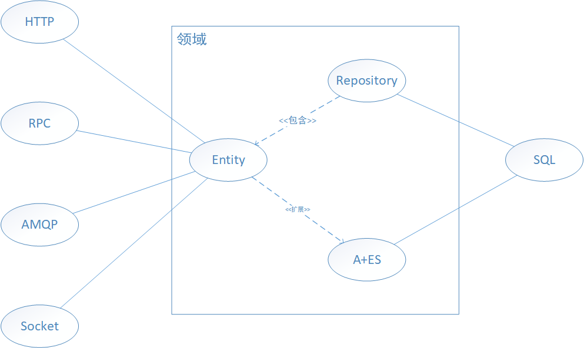  

在传统的三层架构中，将 BLL 层逻辑从 Control 中解放开来，使得 Control 等原 MVC 结构中的业务逻辑变成应用逻辑层，用来响应外部请求。将业务逻辑放入领域实体中，成为领域层，领域层使用基础设施层提供的基础设施完成整体的领域业务。[^DDD]  
[^DDD]: E. Evans, Domain-Driven Design Tackling complexity in the heart of software, 2004.  

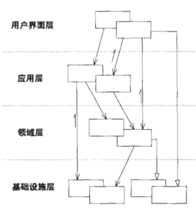  

在框架中，HTTP 请求、 RPC 调用、 AMQP 响应与 Socket 通讯的使用都是位于基础设施层，当请求来临之时，通过调用应用层的应用逻辑代码来进行应用响应，应用层调用领域层的领域实体来执行领域事件。其中领域实体与领域事件位于领域中，由 Core 、 Entity 、A+ES 和 Repository 组成领域基础结构，共同完成领域层建设。  

> · 应用层： 定义软件要完成的任务，并且指挥表达领域概念的领域对象来解决实际的问题，但是应用层本身并不解决问题，因此不包含业务规则或者领域知识，只为领域对象协调任务分配工作并响应用户的请求。  
· 领域层： 负责表达业务概念，业务状态信息以及业务规则。  
· 基础设施层： 提供通用技术能力。  

接下来根据各个模块来说明设计思路与实现方式。  

### 3.1. NetSocket 设计方案  

#### 3.1.1. NetSocket 设计思想  

NetSocket 模块核心的功能便是提供基本 Socket 功能，因此在设计上，在原本的 Socket 工具进行封装的基础上还需要平衡使用的难度，因此在提供易用的方法的基础上给予了一定的自由度。  

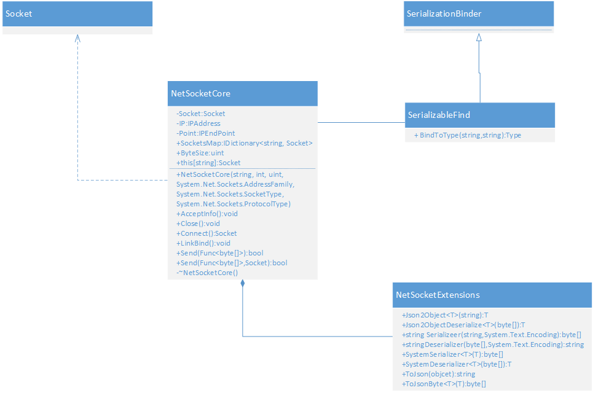  

从类图中可以知道： NetSocket 模块在原有 Socket 的基础上整合了 .NET Core 本身的序列化方法与对对象的 JSON 结构序列化与反序列化的[拓展](PointCloud%20Core/PointCloudCore/Net/NetSocket/NetSocketExtensions.cs)，当然也可以不使用拓展，单独使用 NetSocket 模块，这样就需要自定义序列化与反序列化方式。  

NetSocket 模块的工作流程如下图所示：  

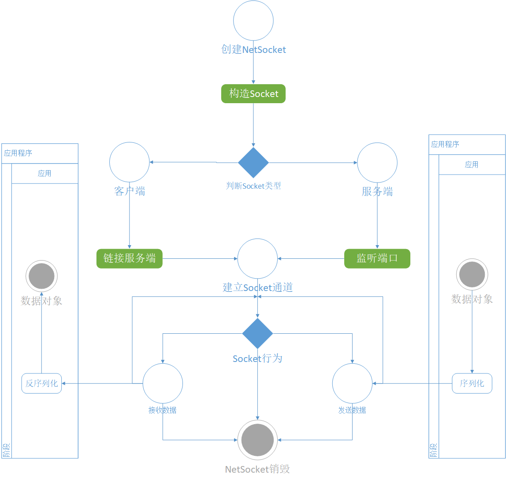  

> 发送可以使用模块自带的 Send 方法来发送数据，但是接收时则必须使用 Socket 中的 receive 方法来接收二进制流，并自行将二进制流反序列化。

#### 3.1.2. NetSocket 代码解析  

· **NetSocket 模块的构建**  

需要明确 IP 地址和 Point 端口号，在初始化中也会设定一个 Byte 字符流最大长度，最关键的是需要明确 Socket 的类型和基础配置。  

```c#
public NetSocketCore(string IP,int Point, uint MB = 1,
                    AddressFamily addressFamily = AddressFamily.InterNetwork,
                    SocketType socketType = SocketType.Stream,
                    ProtocolType protocolType = ProtocolType.Tcp)
{
    this.IP = IPAddress.Parse(IP);
    this.Point = new IPEndPoint(this.IP, Point);
    /*
        AddressFamily.InterNetWork：使用 IP4地址。
        SocketType.Stream：支持可靠、双向、基于连接的字节流，而不重复数据。
        此类型的 Socket 与单个对方主机进行通信，并且在通信开始之前需要远程主机连接。
        Stream 使用传输控制协议 (Tcp) ProtocolType 和 InterNetworkAddressFamily。
        ProtocolType.Tcp：使用传输控制协议。
    */
    Socket = new Socket(addressFamily, socketType, protocolType);
    SocketsMap = new ConcurrentDictionary<string, Socket>();
    Bytesize = MB * 1024 * 1024;
}
```  

· **创建AcceptInfo**  

框架本身提供的 AcceptInfo 实现，当客户端连接时，设置接收超时，并且将客户端的 Socket 句柄添加至 Socket 列表中。此方法可以通过子类重写的方式自定义。

```c#
public virtual void AcceptInfo()
{
    while (true)
    {
        try
        {
            //没有客户端连接时，accept会处于阻塞状态
            Socket tSocket = Socket.Accept();
            tSocket.ReceiveTimeout = 100;
            string point = tSocket.RemoteEndPoint.ToString();
            Console.WriteLine(point + "连接成功！");
            SocketsMap.Add(point, tSocket);
        }
        catch (ErrorException ex)
        {
            ErrorMessage.GetError(ex);
            Socket.Close();
        }
    }
}
```  

· **发送数据**  

NetSocket 模块提供了非常方便的发送数据方法：在原有发送方法的基础上集成序列化方式，在不破坏控制流的前提下，于无感知中完成序列化与发送的操作。  

```c#
public bool Send(Func<byte[]> data)
{
    try
    {
        Socket.Send(data());
    }
    catch (ErrorException ex)
    {
        ErrorMessage.GetError(ex);
        return false;
    }
    return true;
}
```  

Send 方法需要传入一个返回值为 byte[] 类型的函数，因此可以在外部定义好序列化方式后直接将函数注入，即可完成数据发送。  

---  

### 3.2. RPC 设计方案  

#### 3.2.1. RPC 设计思想  

RPC (Remote Procedure Call) 远程过程调用： 旨在通过 Socket 与动态代理的方式，使得调用者就像通过调用本地函数的方式一样，调用远程被调用者的函数。基于 RPC 基本思想，结构设计如下：  

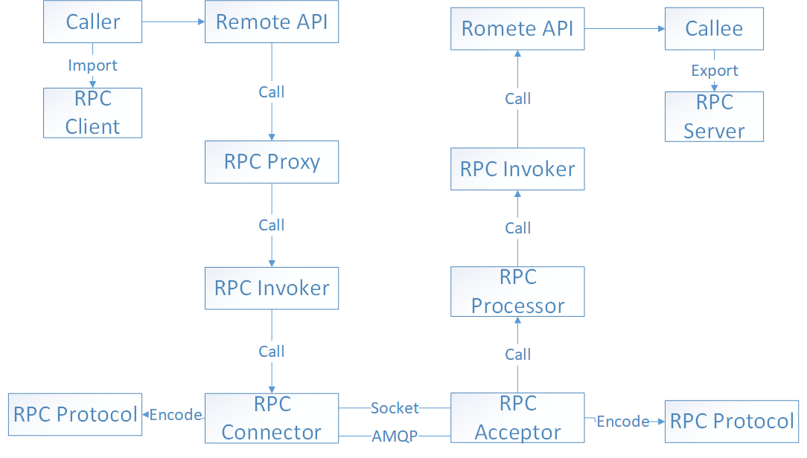  

在设计中，使用 NetSocket 模块来充当 PRC Protocol 与 RPC Connector 的功能，其中RPC Client 中包含着 RPC 代理与 RPC 核心，同样的 RPC Server 中也包含着 RPC 核心与 RPC 调用。  

RPC 类图如下所示：  

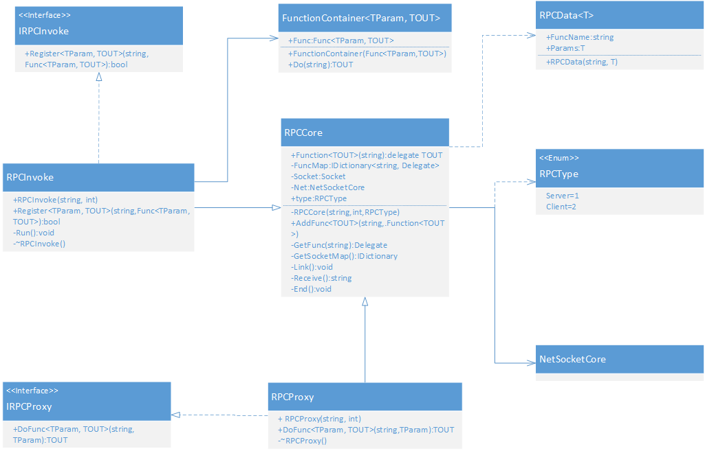  

> RPCInvoke 与 RPCProxy 都是继承于 RPCCore 与对应的接口，这是框架本身提供的 RPC 范式。  

当 RPCInvoke 创建后将会做以下的事情：  

1. 循环对 Socket 进行异步监听。  

2. 当接收到请求后，根据请求信息从 RPCCore 中取出对应的函数容器。  

3. 往容器中注入参数并异步运行函数容器，得到返回结构。  

4. 将结构返回给请求者。  

5. 重复第一点所做。  

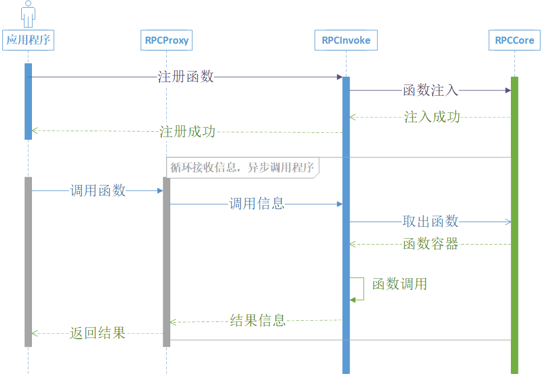  

如图所示，RPCProxy 在调用远程函数的时，会阻塞当前线程以等待返回结果，非线程安全，因此需要自己实现对于 RPCProxy 远程调用的并发执行。  

#### 3.2.2. RPC 代码解析  

在 RPCInvoke 中，对于函数注册函数为一个虚函数，可以通过重写的方式进行自定义注册行为  

```c#
public virtual bool Register<TParam, TOUT>(string FuncName, Func<TParam, TOUT> func)
{
    //创建函数容器
    FunctionContainer<TParam, TOUT> container = new FunctionContainer<TParam, TOUT>(func);
    return AddFunc(FuncName,container.Do) ? true : false;//将函数容器注入函数表中
}
```  

> 在 RPCCore 中函数指针形式为：```c# public delegate TOUT Function<TOUT>(string json);```  

在调用的过程中通过反射的方式调用函数容器里的函数。  

```c#
fun.DynamicInvoke(obj.Value<JObject>("Params"));
```  

---  

### 3.3. Repository 设计方案  

#### 3.3.1. Repository 设计思想  

我们为什么需要 Repository ？ 因为在所有持久对象中，有一小部分必须能够通过基于对象属性搜索的方式来进行全局访问。他们通常是 Entity ，而毫无约束的数据库查询可能会破坏领域对象的封装和聚合，技术基础设施和数据库访问机制的暴露会增加系统的复杂度，并妨碍领域驱动的设计。  

Repository 模式的优点：  

1. 提供了一个简单的模型，可用来获取持久对象并管理它们的生命周期。  

2. 使应用程序和领域设计与持久化技术解耦。  

3. 体现了有关对象访问的设计决策。  

4. 可以很容易将它们替换成“哑实现”，以便在测试中使用。  

在框架中，提供的 Repository 模式是一套基本模板，通过使用模板和接口来完成 Repository 的实例化设计。  

类图结构：  

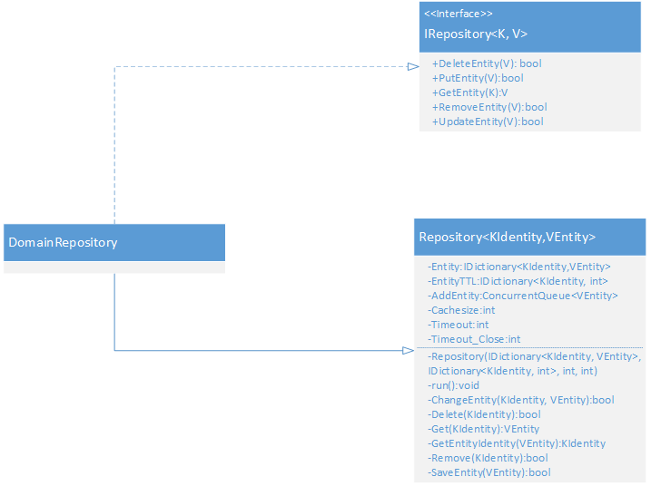  

> Repository 与 Factory 的区别：Factory 负责处理对象生命周期的开始，而 Repository 帮助管理生命周期的中间和结束。  

#### 3.3.2. Repository 代码解析  

框架 Repository 里提供了以下的属性：其中实体缓存和生命周期映射需要子类在构造函数中进行实例化。    

```c#
private IDictionary<KIdentity,VEntity> Entity;//实体缓存
private IDictionary<KIdentity, int> EntityTTL;//实体生存周期映射
protected ConcurrentQueue<VEntity> AddEntity = new ConcurrentQueue<VEntity>();//添加队列
private int Cachesize;//缓存大小
private int Timeout;//过期时间
private int Timeout_Close = 99999;//关闭URL阈值
```  

Repository 构件成功之后则会单独建立一个线程来进行内部管理。  

```c#
protected Repository(IDictionary<KIdentity, VEntity> Entity, IDictionary<KIdentity, int> EntityTTL, int Cachesize, int Timeout)
{
    this.Entity = Entity;
    this.EntityTTL = EntityTTL;
    this.Cachesize = Cachesize;
    this.Timeout = Timeout < Timeout_Close ? Timeout : Timeout_Close;
    Thread t = new Thread(run);
    t.Start();
}
```  

run 方法中提供的是简易的 LRU 方法以及对实体生命周期的管理。  

虽然是一个抽象模板，但是实际上需要实现的方法只有：```c# protected abstract bool SaveEntity(VEntity v);```与```c# protected abstract KIdentity GetEntityIdentity(VEntity v);```当然，直接使用的功能相对来说简陋许多，因此简易在实现子类的同时丰富 DomainRepository 的功能。  

---  

### 3.4. Core 设计方案  

#### 3.4.1. Core 设计思想  

Core 作为核心，设计思想源于微内核架构。因此在设计之初则加入 IOC 模块实现 DI 功能，同时对功能性应用提供强力的支持。  

为什么需要 IOC ？  

Martin Fowler这么说道[^IOC]:  
[^IOC]:Martin Fowler, [Inversion of Control Containers and the Dependency Injection pattern](https://martinfowler.com/articles/injection.html#ComponentsAndServices), 2004

>When these containers talk about how they are so useful because they implement "Inversion of Control" I end up very puzzled. Inversion of control is a common characteristic of frameworks, so saying that these lightweight containers are special because they use inversion of control is like saying my car is special because it has wheels.  
>
>The question is: "what aspect of control are they inverting?" When I first ran into inversion of control, it was in the main control of a user interface. Early user interfaces were controlled by the application program. You would have a sequence of commands like "Enter name", "enter address"; your program would drive the prompts and pick up a response to each one. With graphical (or even screen based) UIs the UI framework would contain this main loop and your program instead provided event handlers for the various fields on the screen. The main control of the program was inverted, moved away from you to the framework.  
>
>For this new breed of containers the inversion is about how they lookup a plugin implementation. In my naive example the lister looked up the finder implementation by directly instantiating it. This stops the finder from being a plugin. The approach that these containers use is to ensure that any user of a plugin follows some convention that allows a separate assembler module to inject the implementation into the lister.  

控制反转是框架的一个常见特征，之所以说这些轻量级容器是特殊的，因为它们使用反向控制。就像车是特殊的，因为它有轮子。  

那什么是依赖注入？正如图下所示：  

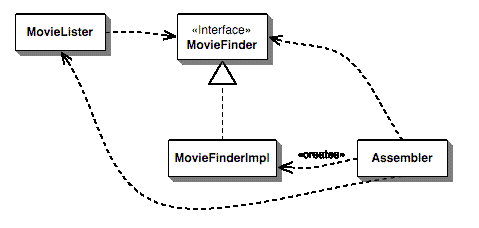  

那框架是如何实现依赖注入的呢？  

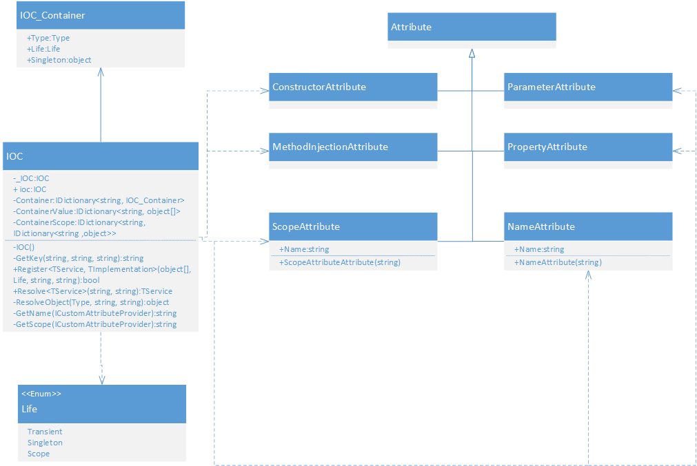  

框架提供的依赖注入方式有三种：  

1. 构造函数注入  

2. 属性注入  

3. 方法注入  

>稍后做实现代码分析  

同时 Core 核心提供了方法的拓展，核心的结构如图所示：  

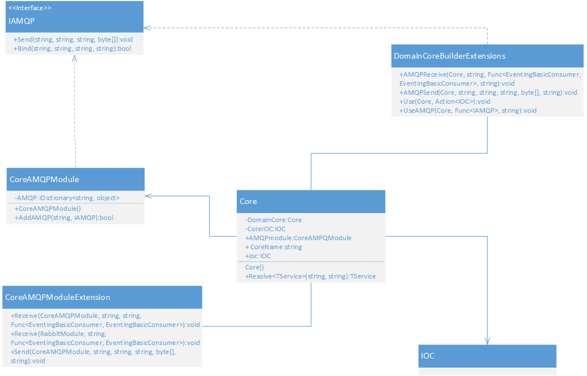  

#### 3.4.2. Core 代码解析  

IOC 实现依赖注入有三种方式：  

· 构造函数注入  

首先是要找到构造函数，如果有构造函数特性标注则选择此构造函数，如果没有特性标注则选择参数最多的构造函数：

```c#
Type type = model.Type;
ConstructorInfo constructor = null;

constructor = type.GetConstructors().FirstOrDefault(c => c.IsDefined(typeof(ConstructorAttribute), true));
if (constructor == null)
{
    constructor = type.GetConstructors().OrderByDescending(c => c.GetParameters().Length).First();
}
```  

> 如果需要使用构造函数注入，建议使用 ```c#[Constructor]``` 进行标注  

然后是找到被特性```c# [Parameter]```标注的参数进行参数注入：

```c#
List<object> paraList = new List<object>();

object[] paraConstant = ContainerValue.ContainsKey(key) ? this.ContainerValue[key] : null;
int iIndex = 0;
foreach (var para in constructor.GetParameters())
{
    if (para.IsDefined(typeof(ParameterAttribute), true))
    {
        paraList.Add(paraConstant[iIndex]);
        iIndex++;
    }
    else
    {
        Type paraType = para.ParameterType;

        string paraName = GetName(para);
        string ScopeName = GetScope(para);
        object paraInstance = ResolveObject(paraType, ScopeName, paraName);
        paraList.Add(paraInstance);
    }
}
```  

最后是调用构造函数：```c# object Instance = constructor.Invoke(paraList.ToArray());```  

· 属性注入  

找到由特性```c# [Property]```标注的属性进行注入  

```c#
foreach (var prop in type.GetProperties().Where(p => p.IsDefined(typeof(PropertyAttribute), true)))
{
    Type propType = prop.PropertyType;
    string paraName = GetName(prop);
    string ScopeName = GetScope(prop);
    object propInstance = ResolveObject(propType, ScopeName, paraName);
    prop.SetValue(Instance, propInstance);
}
```  

· 方法注入同上  

> 需要注意的是，使用特性进行标注的时候可以进行 Name 和 Scope 名字的标记。  
>
> IOC 注册的方法遵循 is-a 法则，便于按照法则执行 DIP ：  

---  

### 3.5. A+ES 设计方案  

#### 3.5.1. A+ES 设计思路  

在哪里使用 A+ES 模式？可以将聚合放置领域模型当中，而领域模型又位于应用服务之后。在应用服务运行时，它将加载聚合并获取对应的领域服务来完成完整的业务操作。当应用服务将处理逻辑委派给聚合的业务方法时，聚合方法将发布事件作为输出并通知所有的事件订阅方。[^A+ES]  
[^A+ES]:Vaughn Vernon, Implementing Domain-Driven Design, 2013  

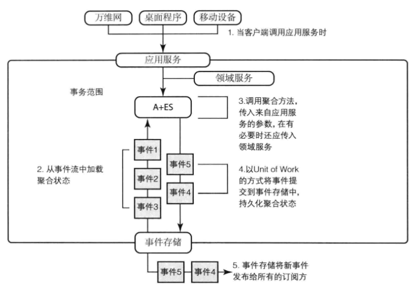  

框架中的 A+ES 包含了上图中的 ApplicationService 还包含了有关于 Entity 、 IEntityID 以及 EventStore 、 Event 的定义，结构如下图所示：  

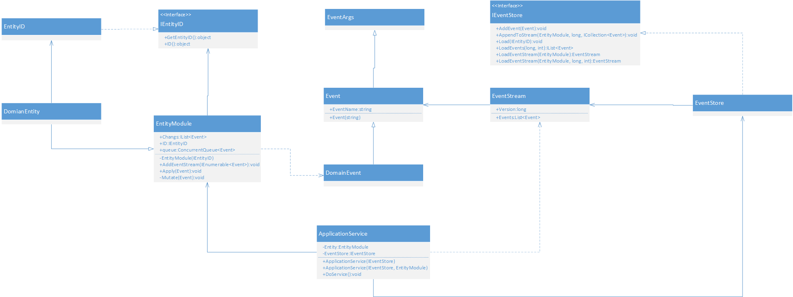  

A+ES 最实际的优点就是带来了结构的自由性：  

· 对于领域专家提出的新行为，可以将聚合内部的状态适配到任何实际的结构中去。  
· 可以在不同部署方案中迁移整个基础设施。  
· 可以通过事件重放来调试系统中的错误。  

当然本框架实现的 A+ES 模式只是简单实现，目的在于帮助学习者了解 A+ES 的原理以及加快对此种模式的理解与掌握。  

## 4. 结束语  

关于 Java 端框架在此：[Java实现领域驱动](https://github.com/tiger5331819/qdu-together-userdomain)

框架的编写是我大学期间最想做的一件事情，也是我大学期间的一个阶段性的结束，通过编写框架，从而让我眼界大开，增长见识。我想成为一名系统架构设计师，这是我踏上这条道路的第一个脚印，千里之行始于足下。  

要感谢我的家人，是他们在我的背后默默的给予我前进的动力，感谢我的爱人泰建雅，她是我航行路上温暖的避风港。  

最后还要感谢张维忠老师的栽培和我的好搭档仉鹏，没有他们也就没有我的成长，感谢 Point Cloud 点云实验室，感谢我的项目组：PointCloud Niphon 以此纪念~  

如果对框架有不理解的，需要我补充的，欢迎联系我，我们一起探讨，共同进步~~~  

·QQ: 563954901  
·微信： shy563954901  
·电话： 17853241669  
·E-mail： tiger5331819@163.com
